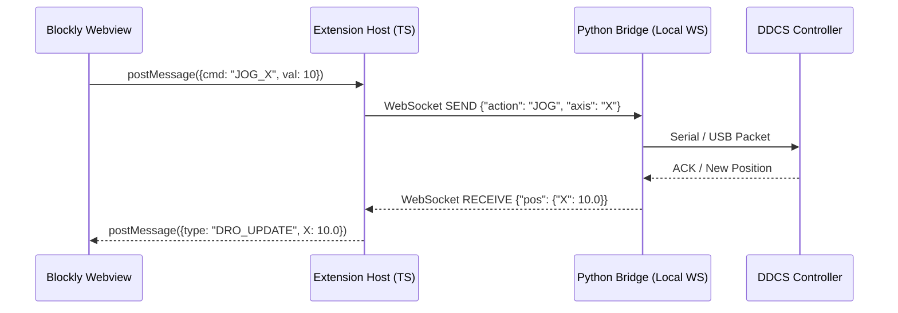

# DDCS Studio VS Code Extension: Comprehensive Architecture

> [!NOTE]
> This document provides an extensive architectural blueprint for the `ddcs-vscode-extension`. It covers the system topology, communication protocols, VS Code API touchpoints, and distribution strategies necessary to successfully port DDCS Studio into a VS Code environment while maintaining a shared codebase with the standalone `.exe`.

---

## 1. System Overview & The Monorepo Strategy

To avoid maintaining two separate codebases (one for the standalone app and one for the extension), the project relies on **Strict Decoupling**.

1. **`core/` (Python):** Headless backend for hardware communication, CAM parsing, and heavy logic.
2. **`web-ui/` (HTML/JS/Blockly):** The frontend visual layer. It has no direct file-system or hardware access.
3. **`ddcs-vscode-extension/` (TypeScript):** The VS Code wrapper. It mounts the `web-ui` inside VS Code panels and spawns the `core` process.

---

## 2. Component Topology & Responsibilities

### 2.1 The Extension Host (TypeScript / Node.js)
The Extension Host is the "brain" of the extension. It runs in VS Code's background Node.js process and has full access to the local file system and VS Code APIs.

**Responsibilities:**
- **Activation:** Listens for `Activation Events` (e.g., user opens a `.ddcs` file, or clicks a command in the palette) to wake up the extension.
- **Process Management:** Spawns the Python core backend as a child process when activated, and ensures it is safely killed when VS Code closes.
- **State Routing:** Acts as a message broker between the sandboxed Webviews and the Python backend.
- **Native Integration:** Handles file Save/Open dialogs, notifications, and reads user preferences from VS Code settings.

### 2.2 The Custom UI (Webviews)
Webviews are essentially `iframes` running inside VS Code. They are heavily sandboxed for security.

**Touchpoints:**
- **WebviewPanels:** Main editor tabs. This is where the primary Blockly workspace or full-screen 3D CAM viewer lives.
- **CustomEditors:** A specific type of WebviewPanel. If you register a Custom Editor for `.ddcs` files, double-clicking a file in the VS Code explorer will automatically open it in your Webview instead of as raw text.
- **WebviewViews:** Sidebar panels (Activity Bar). Ideal for a persistent "Machine Status" or "Toolbox" view that remains visible while the user edits other code files.

### 2.3 The Core Backend (Python Bridge)
The Python backend handles the actual machine logic, g-code generation, and serial communication.

**Integration Strategy:**
- Runs completely headless.
- Does not import any UI libraries (no PyQt, no Tkinter).

---

## 3. Communication Protocols

Because the UI is sandboxed and the backend is an external process, communication is critical.

### Webview ↔ Extension Host (The Frontend Link)
- **Mechanism:** Asynchronous Message Passing.
- **API:** Inside the Webview, you call `vscode.postMessage({ command: 'generate_gcode', data: blocks })`.
- **API:** Inside the Host, you listen via `panel.webview.onDidReceiveMessage(...)`.

### Extension Host ↔ Python Backend (The Backend Link)
There are two primary ways to handle this:
1. **Standard I/O (stdio):** The Extension Host spawns Python and writes JSON strings to `stdin`, reading responses from `stdout`. This is lightweight but can be tricky if Python prints random logs that break the JSON parser.
2. **Local Server (Highly Recommended):** The Python process boots up a lightweight local WebSocket or HTTP server (e.g., `localhost:8080`). The Extension Host connects to it.
   - *Why WebSocket?* CNC machines stream real-time position data (DRO). WebSockets handle high-frequency, bidirectional streams much better than standard HTTP or stdio.

### The Full Data Flow

---

## 4. Distributing the Python Backend

A major challenge with VS Code extensions is ensuring users have the right dependencies. You cannot guarantee a user has Python 3.10+ or `pyserial` installed.

### Approach A: The "Bring Your Own Python" Method
- The extension finds the user's local Python installation using the official VS Code Python API.
- It creates a virtual environment (`.venv`) and runs `pip install -r requirements.txt` on first launch.
- *Pros:* Small extension file size.
- *Cons:* Prone to failure if the user's local Python setup is broken or missing.

### Approach B: The "Bundled Executable" Method (Recommended)
- During your build process, you use `PyInstaller` to compile the Python backend into standalone executables (e.g., `bridge-win.exe`, `bridge-mac`).
- You bundle the executable directly inside the `.vsix` extension package.
- *Pros:* "It just works." Zero setup for the end-user. Extremely reliable for machine shops and non-developers.
- *Cons:* Larger download size. You must publish Platform-Specific Extensions (e.g., one VSIX for Windows, one for Mac, one for Linux).

---

## 5. Development Workflow

To work on this extension effectively, you need to run two things at once:
1. **The Extension Debugger:** Pressing `F5` in VS Code compiles your TypeScript and launches a new "Extension Development Host" window.
2. **The Web UI Server (Optional but helpful):** Instead of copying HTML files every time you make a change to the CSS, during development the Extension Host can load `http://localhost:3000` (a Vite/React/Vanilla dev server running your `web-ui` code) so you get Hot Module Replacement (HMR) right inside the VS Code tab.

---

## 6. Implementation Roadmap

### Phase 1: Boilerplate & Prototyping
- [ ] Run `npx yo code` to generate the TypeScript boilerplate.
- [ ] Create a basic `WebviewPanel` that simply loads an `<iframe>` of the existing DDCS Studio web app running locally to prove it works.

### Phase 2: Decoupling & The Build Step
- [ ] Update the `DDCS-Studio/web` code to check if it is running inside VS Code (`acquireVsCodeApi()`) or in a browser, and route its API calls accordingly.
- [ ] Create an `esbuild` script that automatically copies the production-ready `web` files into the extension's `out/` directory.

### Phase 3: The Headless Bridge
- [ ] Strip all GUI code from `fairy_gateway.py`.
- [ ] Implement a WebSocket server in the Python bridge to listen for commands and broadcast machine state.
- [ ] Write TypeScript logic in the Extension Host to automatically spawn the Python executable on startup.

### Phase 4: Native VS Code Integration
- [ ] Register a `CustomEditorProvider` so `.ddcs` project files open directly into the Blockly interface.
- [ ] Add VS Code settings (`contributes.configuration` in `package.json`) so users can configure COM ports natively in VS Code's settings UI.
- [ ] Package via `vsce` for distribution.
